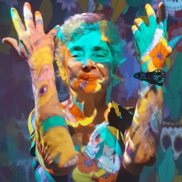
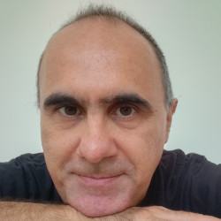
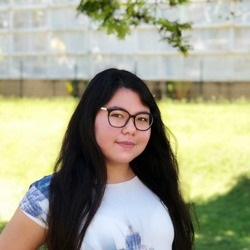
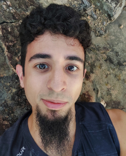
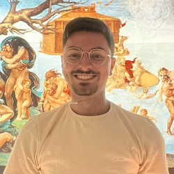
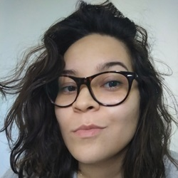
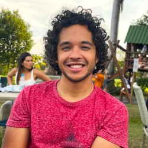
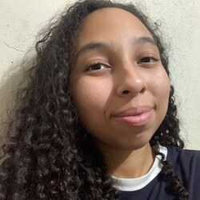

<!-- 
  1. Imagens sejam limitadas a 250px x 250px
 -->

{: .align-left} **Claudia Bauzer Medeiros** is full professor of databases at the Institute of Computing, University of Campinas (Unicamp), Brazil. She holds a degree in Electrical Engineering (1976) and an MSc degree in Computer Science (1979) from PUC-Rio, Brazil and a PhD in Computer Science from the University of Waterloo, Canada (1985). For the past 20 years, she has been working as a visiting professor at the University Paris-Dauphine, France. She has received Brazilian and international awards for research, teaching, and also for her work in fostering the participation of women in IT-related activities.

 

{: .align-right} **André Santanché** is coordinator of the Laboratory of Information Systems (LIS) at IC. His research interests involve three main topics, which are also interconnected: e-science (mainly applied to health), data science (especially knowledge representation, natural language processing, and network science), and e-learning (collaborative platform for learning and research).

 
---
# PhD

{: .align-left} **Caroline Gerbaudo Nakazato** holds a master degree in Computer Science and is currently interested on e-learning, graphic organizer, visual novel, particularly aimed at collaborative platform for health learning.

 

{: .align-right} **Heitor Mattosinho** is a doctoral candidate at IC, University of Campinas, Brazil. His research interests are towards e-learning platforms and natural language processing. He is currently working with Large Language Models and Knowledge Graphs focusing on the generation of Virtual Patient and feedback for medical students.

 
---

# Master

{: .align-left} **Gabriel de Freitas Leite** holds a degree in Control and Automation Engineering and is currently interested on unsupervised learning and exploratory data analysis. He works with clustering algorithms, particularly aimed at enhancing the understanding of clinical data.

 

{: .align-right} **Mylena Roberta** holds degrees in both Computer Engineering and Computer Science. Her research interests span across data science, network science, and computational biology. She currently works with complex networks applied to transcriptomic data and network medicine.

 

{: .align-left} **Talles Viana Vargas** holds a degree in Electrical Engineering and is currently interested on deep learning, computer vision, and natural language processing (NLP). He works with multi-modal models, particularly aimed at enhancing X-ray description tasks.

 
---

# Scientific Initiation

{: .align-right} **Geovana Oliveira** is a second-year Interdisciplinary Higher Education Program (ProFIS) student at the University of Campinas. She is currently working on a learning model based on cellular automata, focusing on cancer education.